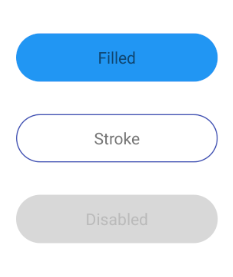

# RoundedButton
A small library that adds a button widget with completely rounded corners.

Setup
=======
Add the following lines to your build.gradle file:
```
dependencies {
    compile "io.intrepid.roundedbutton:roundedbutton:1.0.0"
}
```

Details
=======
A simple button widget with a rectanglular background where both ends are cornered like a semi circle. Both the fill color and the stroke color/width can be customized. The widget also automatically darkens the fill color when touched (default behavior, can be set to a specific color too) and uses a different color for disabled state.
<br/>



Usage
=====
Simply include `io.intrepid.roundedbutton.RoundedButton` in the layout xml and treat it like any other TextView/Button. The fill color, stroke color, stroke width, pressed color, and disabled color can also be customized:
```
<io.intrepid.roundedbutton.RoundedButton
    android:layout_width="200dp"
    android:layout_height="48dp"
    android:layout_marginBottom="32dp"
    android:text="Click"
    android:textColor="@android:color/black"
    android:textSize="16sp"
    app:rb_fill_color="@color/colorAccent"
    app:rb_stroke_color="#11dd11"
    app:rb_stroke_width="0.5dp"
    app:rb_pressed_color="#303f9f"
    app:rb_disabled_color="#dd1111"
    />
```

The widget can also be instantiated programmatically just like other Views.

License
=======
```
Copyright 2017 Intrepid Pursuits LLC.

Licensed under the Apache License, Version 2.0 (the "License");
you may not use this file except in compliance with the License.
You may obtain a copy of the License at

   http://www.apache.org/licenses/LICENSE-2.0

Unless required by applicable law or agreed to in writing, software
distributed under the License is distributed on an "AS IS" BASIS,
WITHOUT WARRANTIES OR CONDITIONS OF ANY KIND, either express or implied.
See the License for the specific language governing permissions and
limitations under the License.
```
